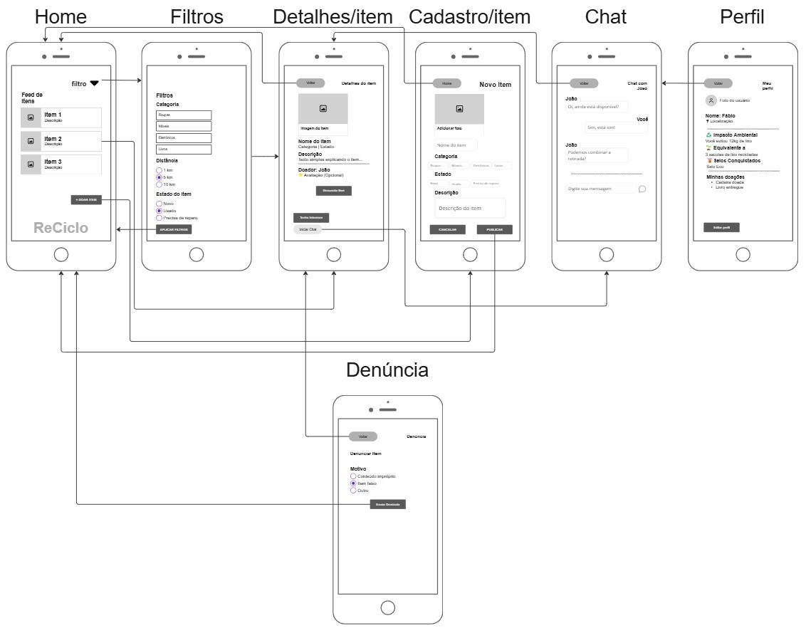

# ♻️ Projeto ReCiclo

## 👤 Aluno
Fábio Henrique Zanini Ferreira

---

## 💡 Proposta de Valor

O aplicativo ReCiclo tem como objetivo conectar pessoas que desejam doar objetos com outras que precisam desses itens, promovendo reutilização e reduzindo o descarte desnecessário.

O principal benefício é facilitar a doação de forma simples, rápida e sustentável, incentivando práticas ecológicas através da interação entre usuários.

---

## 🧩 Descrição das Telas

- **Feed / Home:** Exibe os itens disponíveis para doação, permitindo ao usuário visualizar opções próximas.

- **Filtros:** Permite refinar a busca por categoria e preferências, facilitando encontrar itens específicos.

- **Detalhes do Item:** Mostra informações completas do item, além da opção de iniciar contato ou denunciar conteúdo impróprio.

- **Cadastro de Item:** Tela onde o usuário pode cadastrar um novo item para doação, preenchendo informações básicas.

- **Chat:** Permite a comunicação entre doador e interessado para combinar a retirada do item.

- **Perfil:** Exibe informações do usuário, histórico de interações e impacto ambiental gerado.

- **Tela de Denúncia:** Permite reportar itens inadequados, contribuindo para a segurança e qualidade da plataforma.

---

## 🔄 Jornada Principal do Usuário

O usuário acessa o aplicativo e visualiza os itens disponíveis no feed.

Ao selecionar um item, é direcionado para a tela de detalhes, onde pode analisar as informações e iniciar uma conversa com o doador.

Através do chat, os usuários combinam a retirada do item. Após a conclusão da interação, o usuário pode visualizar seu perfil, acompanhar seu histórico e receber reconhecimento pelas ações realizadas.

---

## 🌱 Funcionalidades Extras (Diferencial)

- **Impactômetro:** Exibe a quantidade de resíduos que o usuário ajudou a evitar, incentivando práticas sustentáveis.

- **Sistema de Denúncia:** Permite que usuários reportem itens impróprios, garantindo maior segurança na plataforma.

---

## 📸 Protótipo

